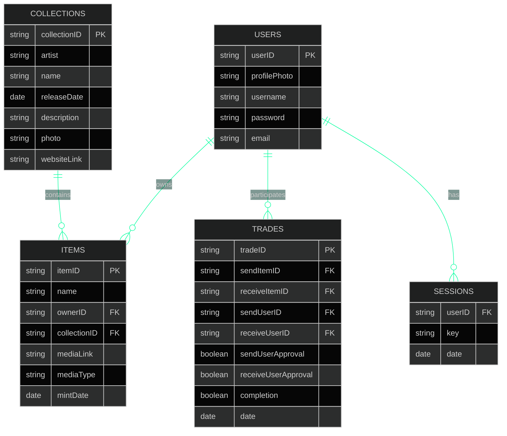
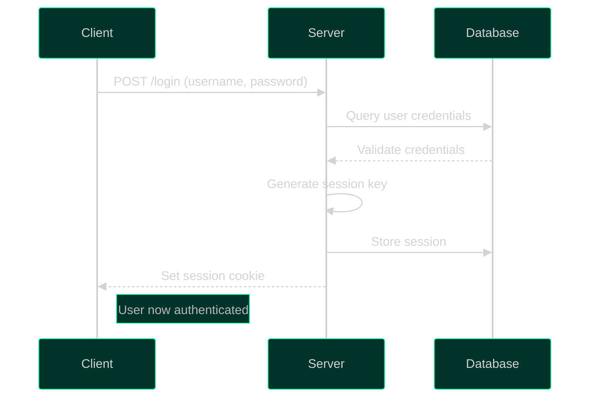
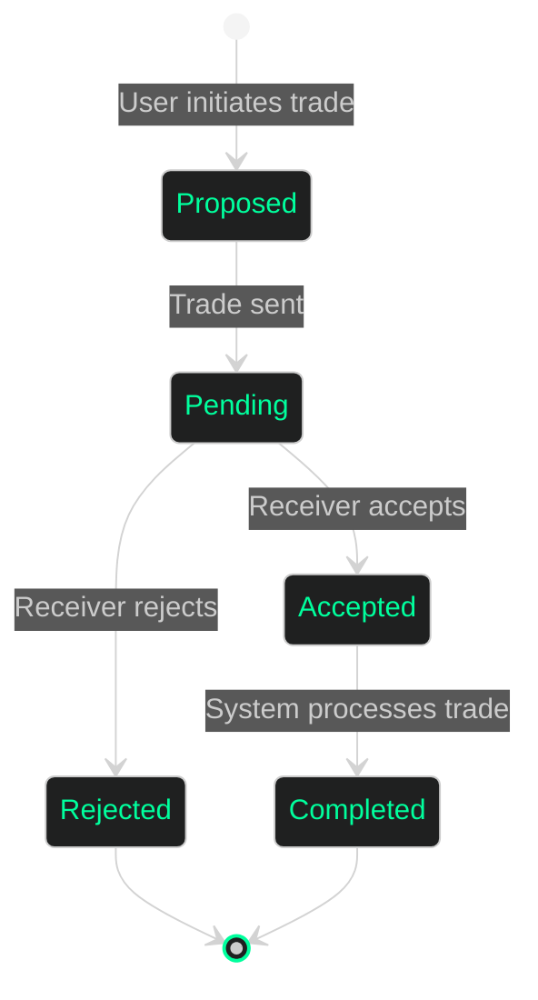

# MintDrop 🎨

A platform streamlining NFT collections, mints and trades.

## 📋 Table of Contents
- [Overview](#overview)
- [System Architecture](#system-architecture) 
- [Features](#features)
- [Database Schema](#database-schema)
- [API Routes](#api-routes)
- [Authentication Flow](#authentication-flow)
- [Trade System](#trade-system)
- [Installation](#installation)
- [Tech Stack](#tech-stack)

## Overview

MintDrop is a web application for managing and trading NFT collections. It provides a platform for:
- Browsing upcoming and existing NFT collections
- Managing personal NFT inventories 
- Trading NFTs between users
- User authentication and profiles

## System Architecture

```mermaid
%%{init: {
  'theme': 'dark',
  'themeVariables': {
    'primaryColor': '#00ff9d',
    'primaryTextColor': '#fff',
    'primaryBorderColor': '#00ff9d',
    'lineColor': '#00ff9d',
    'secondaryColor': '#006647',
    'tertiaryColor': '#003329',
    'background': '#1a1a1a'
  }
}}%%
graph TB
    style Client fill:#003329,stroke:#00ff9d,stroke-width:2px
    style Server fill:#003329,stroke:#00ff9d,stroke-width:2px
    style DB fill:#003329,stroke:#00ff9d,stroke-width:2px
    style Static fill:#003329,stroke:#00ff9d,stroke-width:2px
    style Backend fill:#1a1a1a,stroke:#00ff9d,stroke-width:2px

    Client[Web Client]
    Server[Express Server]
    DB[(SQLite DB)]
    Static[Static Assets]
    
    Client -->|HTTP Requests| Server
    Server -->|Handlebars Templates| Client
    Server -->|Queries| DB
    Server -->|Images/CSS| Static
    
    subgraph Backend
        Server
        DB
        Static
    end
```



## Features

### 🎭 Collection Management
- Browse upcoming and existing NFT collections
- View collection details and items
- Track mint dates and releases

### 🔄 Trading System
- Propose trades between users
- Review incoming trade requests 
- Accept/reject trade offers
- Trade history tracking

### 👤 User System
- User registration and authentication
- Profile management
- Personal inventory tracking
- Session management with cookies

## Database Schema



## API Routes

### Authentication Routes
```
POST /login             - User login
POST /logout           - User logout 
POST /create/user      - Create new user
```

### Collection Routes
```
GET /collections           - List all collections
GET /collections/:id      - View specific collection
```

### Trading Routes
```
GET /trades                    - View trade inbox
GET /trades/:username         - Initiate trade with user
POST /trades/accept/:tradeID  - Accept trade
POST /trades/reject/:tradeID  - Reject trade
```

### User Routes
```
GET /users                - List all users
GET /profile              - View own profile
GET /profile/:username    - View user profile
GET /inventory            - View own inventory
GET /inventory/:username  - View user inventory
```

## Authentication Flow



## Trade System



## Installation

1. Clone the repository:
```bash
git clone https://github.com/your-username/mintdrop.git
```

2. Install dependencies:
```bash
npm install
```

3. Initialize the database:
```bash
node db-setup.js
```

4. Start the server:
```bash
npm start
```

The application will be available at `http://localhost:3000`

## Tech Stack

- **Frontend**: Handlebars, Bootstrap, CSS
- **Backend**: Node.js, Express
- **Database**: SQLite3
- **Authentication**: Cookie-based sessions
- **Utils**: Crypto for password hashing, Axios for external APIs

## Environment Variables

The following environment variables can be set:
```
PORT=3000                  # Server port (default: 3000)
SESSION_SECRET=secret      # Session encryption key
```

## License

This project is licensed under the MIT License - see the LICENSE file for details.